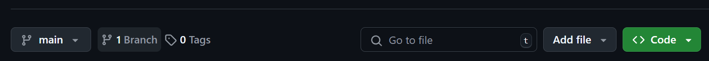
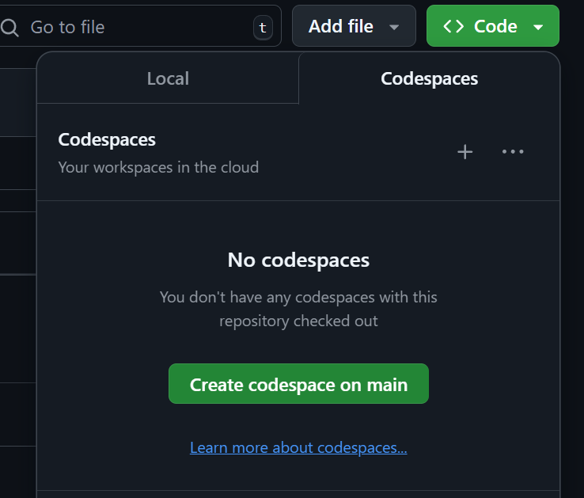

# Assignment: Data Cleaning and Preprocessing

## Assignment Objectives

* Increase familiarity with Pandas and SciKit Learn libraries for data cleaning
* Learn how to work with messy datasets
* Learn how to combine different datasets
* Understand the importance of data preprocessing for improving model performance
* Gain experience in encoding categorical features and normalizing numerical features

## Pre-requisites

* Knowledge of the basic syntax of Python is expected

## Overview

A team of doctors and scientists have been working to combat Chronic Kidney Disease (CKD). They've collected detailed medical data from 400 patients. This dataset is crucial for understanding and predicting CKD. Your mission is to clean and preprocess this dataset to prepare it for machine learning!

You'll be given 2 dirty datasets. Apply data cleaning techniques using pandas functions to create a clean and preprocessed dataset.

## Data Cleaning Assignment Datasets

[Click here to access this assignment's dataset](https://drive.google.com/drive/folders/14jAZoXUBXtnj81uQZwjGeyxSAULnbweN?usp=share_link)

## Useful Tutorials and Documentation

### Pandas

There are many different data loading/analysis libraries out there for python but don't reinvent the wheel. Pandas is by far the most universally used library for manipulating datasets. It includes tools for loading datasets, slicing/combining the data, and easily transforming back and forth to NumPy primitives. The following tutorials should cover some but not all the tools you will need to complete this assignment.

* [How do I read and write tabular data?](https://pandas.pydata.org/docs/getting_started/intro_tutorials/02_read_write.html)
* [pandas.DataFrame.dropna](https://pandas.pydata.org/docs/reference/api/pandas.DataFrame.dropna.html)
* [pandas.get_dummies](https://pandas.pydata.org/docs/reference/api/pandas.get_dummies.html)

## Starter Code

* CS 383 Data Cleaning Assignment.ipynb

1. **Open in Codespace:** 
    * Click on the green "<> Code" button.
     
    
     
    * In the dropdown box, there should be an option to "Codespace" button. Click that, and then click the green "Create codespace on main"
     
    
     

2. **Wait for Setup:** GitHub will set up a cloud-based development environment with all the necessary tools. This might take a few minutes.
3. **Start Coding:** Once the Codespace is ready, you'll have a full VS Code editor in your browser, with the repository code loaded and ready to go. You can now start working on the assignment!
4. **Commit/Save changes:** Remember to **commit** your changes (in the same way you normally do) before exiting the codespace environment. 
5. **Codespaces:** Codespaces would make it much easier for you to start the assignment in one-click as you wouldn't have to manually clone the project in your local. Also becuase this project includes the use of Jupyter notebooks, you wouldn't have to worry about having a local Jupyter notebook environment when your working on GitHub codespaces.
    - But if you prefer do prefer doing it locally as always, feel free to do so. 
    - Don't hesitate to reach out with any questions over campuswire

**Important Notes:**

* You'll need a GitHub account and may need to enable Codespaces in your settings.
* There might be limitations on Codespaces usage depending on your GitHub plan.
* Make sure you save your work regularly, as Codespaces might time out after a period of inactivity.

## Submissions

- The coding projects for this course are hosted on GitHub classrooms, so we require you to have your project in a GitHub repo.
- To make a submission for the project, fill out and submit *Assignment 3* on gradescope. 
- Your *Assignment 3* submission on gradescope just asks you for: 
    - Your name
    - Your GitHub handle's username
    - The url of your repo (for example: github.com/YOUR_SUBMISSION)
    - The commit id of your submission

---
